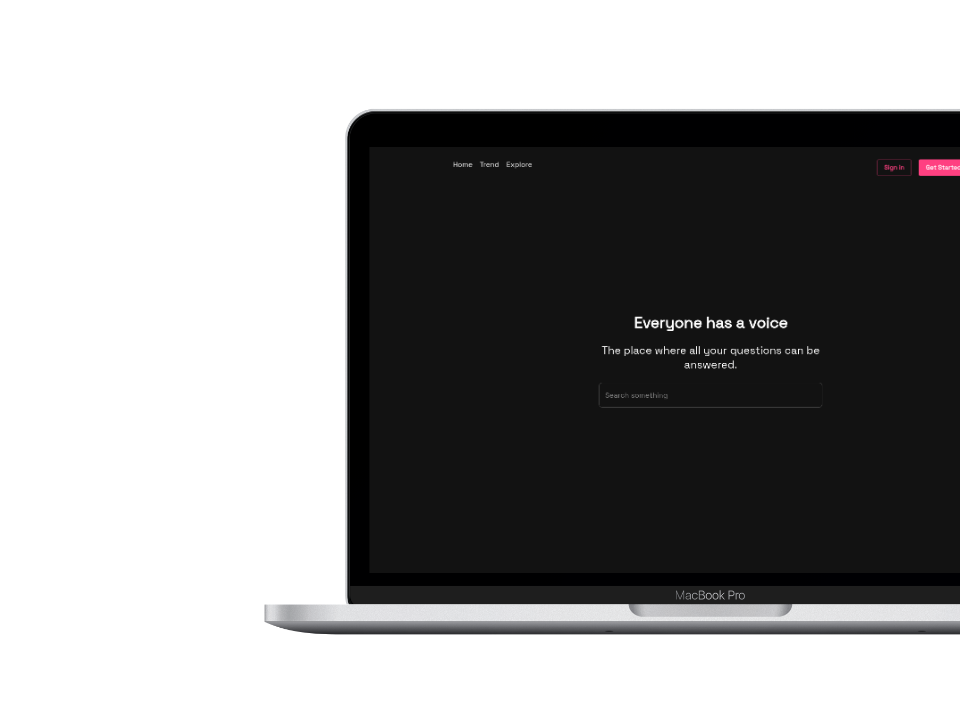
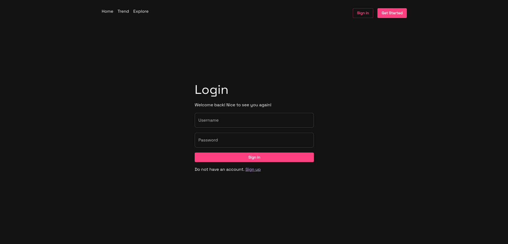
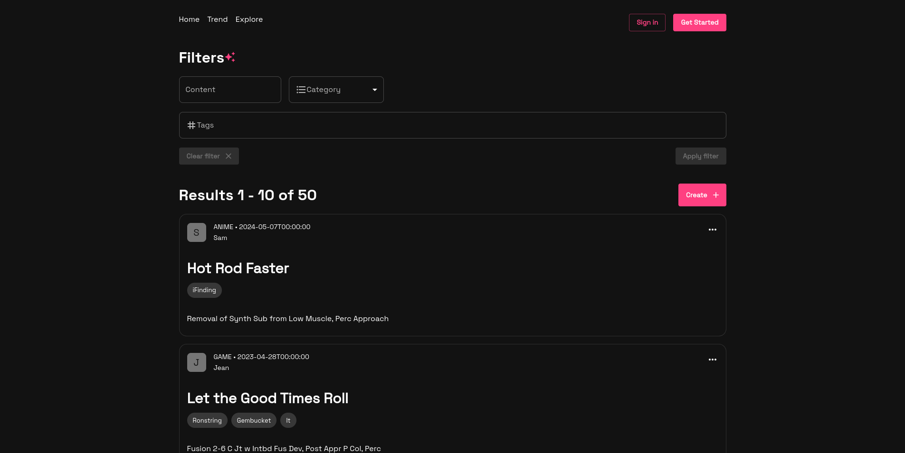
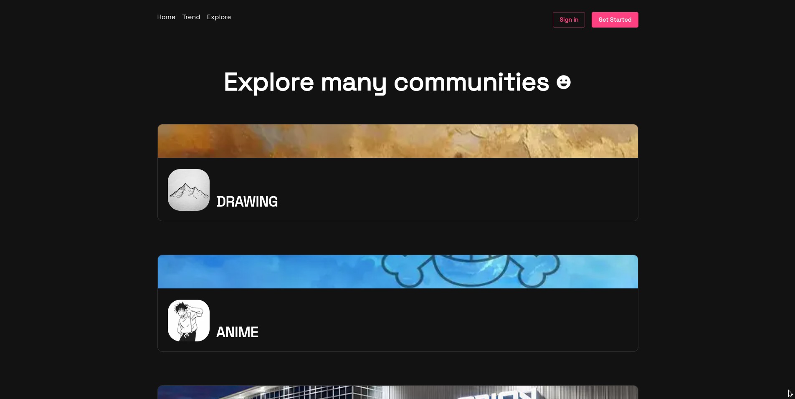
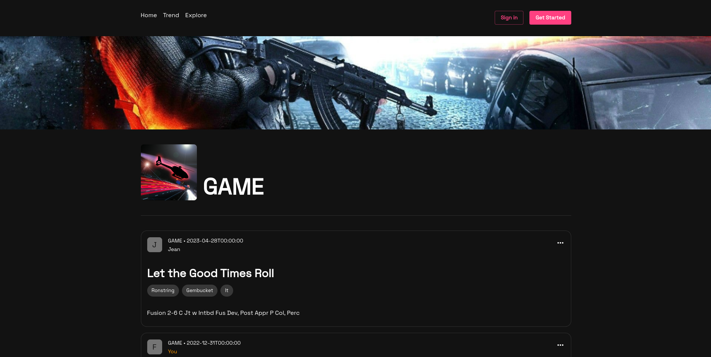
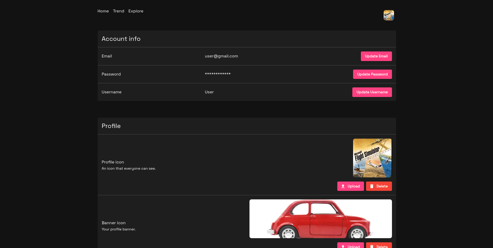
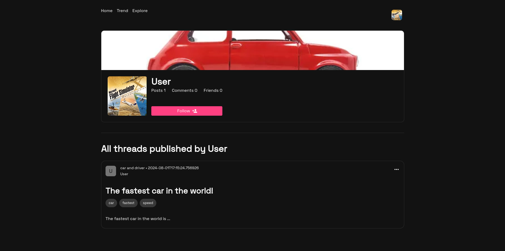

# Pekilla

Pekilla is a forum that we made in the summer of 2024.



## Features

- TO DO

## Technologies

### Backend

- Java
- Spring Boot
- Lombok

### Frontend

- Typescript
- React
- NextJS
- Axios
- MUI

## Installation
<!-- Dependencies -->
<details open><summary><b>External dependencies</b></summary>

- [bun](https://bun.sh/)
- [docker](https://www.docker.com/)
- [JDK 17](https://www.oracle.com/ca-en/java/technologies/downloads/#java17)

</details>
<br />

<!-- Images section -->
<details open><summary><b>Images Server</b></summary>

Setup :
```shell
git clone https://github.com/Pekilla/temporary-serve-project
cd temporary-serve-project/
bun install
```

</details>
<br />

<!-- Backend section -->
<details open><summary><b>Backend</b></summary>

Setup :
```
git clone https://github.com/Pekilla/pekilla-backend
```

Create the file `env.properties` in the root folder that contains this :
```properties
# Backend port
PORT=

# Should be the URL of the frontend
ALLOWED_URL=

# The values for the images server
IMAGE_SERVER_URL=http://localhost:2500

# The path where you have the repository of the images server(temporary-serve-project). The path should end with /public
UPLOAD_PATH=

# The key used by JWT to generate the token.
SECRET_JWT_KEY=

APP_EMAIL=support@pekilla.com

# For now, you can put random value for the username and password because we use mailpit for development. But they cannot be empty
MAIL_USERNAME=
MAIL_PASSWORD=
# For know, you should use these values because of mailpit.
MAIL_HOST=localhost
MAIL_PORT=1025

# These values are going to be set to the docker container of the postgresql database.
POSTGRES_USER=
POSTGRES_PASSWORD=
POSTGRES_DB=
```
</details>
<br />

<!-- Frontend section -->
<details open><summary><b>Frontend</b></summary>

Setup :
```
git clone https://github.com/Pekilla/pekilla-frontend
cd pekilla-frontend/
bun install
```

Create a file named `.env.local` in the root folder with this content :
```properties
# Random long string for next-auth
AUTH_SECRET=
```
</details>

## Run the project

```sh
# Frontend
bun run dev

# Backend: run with your IDE or :
./mvnw spring-boot:run

# Image server
bun start
```

## Preview












